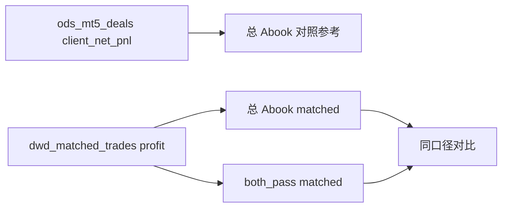

# 多空分向面板：1/2/4/5/11 改动计划

## 关于第 2 项：两套利润为什么不一样

不是同一数字的两种写法，而是**两张表、两套定义**：

| | 总 Abook 验证期 | Both 验证期 |
|---|---|---|
| 来源 | `ods_mt5_deals` | `dwd_matched_trades` |
| 公式 | `profit + storage + commission + fee` | `sum(matched.profit)`（Long+Short） |
| 覆盖 | 全部买卖成交（action 0/1） | 能配对到的 matched 行 |

因此即便「数据没错」，两边也通常不相等：成本项、配对覆盖率、时间对齐都会拉开差距。分向面板又**没法**把 deals 的 storage/commission/fee 按 Long/Short 拆开，所以分向侧只能用 matched。

**第 2 项真正要改的**不是强行让两个数相等，而是：对比区用**同一 matched 口径**比较两个人群（总 Abook vs both_pass），这样「谁更赚钱」才可比；deals 客户净 P&L 仍可作为对照参考，但必须单独标注，不再和 matched 并排放成「看起来同义」的两行。

---

## 改动范围

### 1. 名单驱动图表/汇总（前端为主）

文件：[frontend/src/components/DirectionPanel.vue](frontend/src/components/DirectionPanel.vue)

- `phaseData` / 累积曲线 / P&L 分布：从固定 `passSet(which)` 改为使用当前 `activeSet`（经 `payloadFor(book, activeSet)`）。
- Top 用户已跟 `activeSet`，保持不变。
- 顶部 KPI「过线人数」仍用 `book_counts[book][long_pass|short_pass]`，作为全局锚点，不随名单变。
- 用户结构区标题/hint 继续标明「当前名单」。

### 2. 对比区同口径 matched + deals 对照

文件：[app/direction_analytics.py](app/direction_analytics.py)、[DirectionPanel.vue](frontend/src/components/DirectionPanel.vue)、相关单测

后端 `comparison` 调整为：

- `total_abook_validation_matched_profit`：总 Abook 账户验证期 `long.side_pnl + short.side_pnl`
- `both_pass_validation_matched_profit`：保持现有（both 名单同口径）
- `total_abook_validation_client_net_pnl`：保留，但前端单独标为「deals 客户净 P&L（对照）」

前端卡片改为：

- 主对比：总 Abook matched vs Both matched（同口径）
- 次行：总 Abook deals 客户净（对照，不参与「谁更大」的视觉暗示）

更新 [tests/test_direction_analytics.py](tests/test_direction_analytics.py) 中 `test_direction_comparison_keeps_total_abook_deals_pnl_separate_from_matched_profit`：断言新字段存在，且 deals 字段仍单独保留。

### 4. 扩展 AccountDrawer（你选的方案 1）

文件：[AccountDrawer.vue](frontend/src/components/AccountDrawer.vue)、[App.vue](frontend/src/App.vue)

- 新增可选 prop：`directionAccount`（分向 compact 行）。
- 有值时，抽屉顶部增加「分向摘要」块：象限、`in_total_abook`、多空交易占比、筛选/验证两侧 trades / 胜率 / PF / payoff / side_pnl / sample_status、未过原因 flags、共享闸门（杠杆/马丁）。
- 下方仍走现有总账详情（客户净 P&L、集中度、markout 等），不新开 API。
- `openDirectionAccount`：用 `population_accounts || accounts` 匹配；匹配不到时用分向行拼最小 `AccountRow` 仍可拉详情；同时把该分向行写入 `selectedDirectionAccount`，关闭时清空。

### 5. 小额过滤显式化（你选的方案 2）

文件：`DirectionPanel.vue` + 前端契约测试

- 保留默认：`activeSet === 'all'` 时隐藏 `|side_pnl| ≤ 10`（当前阶段）。
- 工具栏增加勾选：「隐藏小额 ±10」（默认开）。
- hint 显示：`显示 X / 名单 Y`（过滤后数 / 过滤前数）。
- 非 `all` 名单不受此开关影响（与现状一致）。

注意：后端 `_has_material_direction_pnl` 仍决定哪些账户进入 `accounts` 列表；本次只改前端静默过滤的可发现性，不扩大后端返回全集（避免 payload 暴涨）。若勾选关闭后仍看不到「极小额且未过线」账户，hint 可注明「列表本身已按 material/过线压缩」。

### 11. 进入 Tab 自动懒加载

文件：[App.vue](frontend/src/App.vue)

- `selectTab`：当 `tab === 'direction'` 时调用 `loadDirection()`（与 `loadBook` 对称）。
- 保留「重新运行分向筛选」= `directionData = null` 后强制重拉。
- 更新 [tests/test_frontend_contract.py](tests/test_frontend_contract.py) 中要求「必须手动点运行」的断言，改为允许 Tab 懒加载 + 保留重跑按钮。

---

## 测试与构建

- 更新/补充：`tests/test_direction_analytics.py`、`tests/test_frontend_contract.py`
- 跑相关 pytest；前端 `pnpm run build` 同步 `static/`

## 不做

- 不改主 Abook 路由
- 不做品种热力/风格分桶（原第 3 项）
- 不扩大 direction `accounts` 后端返回全集（仅前端开关）
