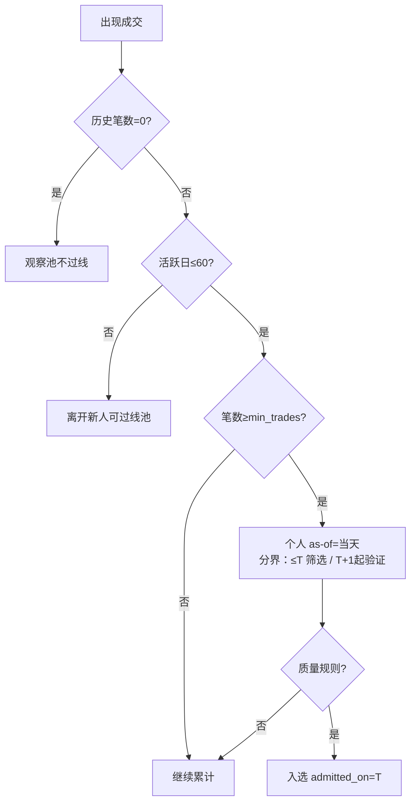

# 新人滚动筛 Tab 制作计划

> **状态：** P0–P2 已落地（API + Tab + 单用户敏感性）；P3 导出可后做  
> **日期：** 2026-07-24  
> **目标：** 新增独立「新人滚动筛」Tab，专门处理短历史 / 晚进场用户；与总览 Abook 的名单、验证窗、KPI 完全隔离。

## 1. 为什么单独做 Tab

总览 Abook 用统一筛选期末 + 统一验证窗。新人每人一条「个人分界线」，验证区间因人而异；混进总览会乱 KPI。

- **总览**：常规 Abook（当前 30K 默认），不动。
- **新人 Tab**：独立入池、个人 as-of、入选后验证；**不写回**总览 Abook。

## 2. 核心概念

### as-of / 个人分界线

**个人 as-of \(T_i\)** = 该用户「筛选期结束、验证期开始」的分界日：

- **筛选侧：** 只用日期 ≤ \(T_i\) 的完整可用数据算质量指标  
- **验证侧：** 只统计日期 ≥ \(T_i+1\) 至分析期末（默认请求的 `validation_end`）的客户净 P&L  

as-of **允许落在筛选期或验证期任意日历日**，只要该日满足成熟条件（已确认）。

### 短历史 \(N=60\)

截至个人 as-of，累计**活跃交易日** ≤ `N=60`（与约 60 天筛选期对齐，避免漏掉 30–60 日档）。  
活跃交易日 = 当日有成交的日历日。

### 0 笔观察池

截至评估时点历史 0 笔：只进**观察池**，不过线（已确认）。

## 3. 个人 as-of 怎么定

### 名单批处理（默认）

Tab 级参数 `min_trades`（默认 75，可改）：

\[
T_i = \text{最早一天：累计笔数} \ge min\_trades\ \land\ \text{累计活跃日} \le 60
\]

- 用截至 \(T_i\) 的完整历史做质量筛选（复用总览规则，可 Tab 内覆盖）  
- 过线 → `admitted_on = T_i`  
- 若活跃日已到 60 仍凑不齐 `min_trades`：在第 60 个活跃日评一次；不过则离开可过线池  



### 单用户敏感性分析（改进点，已确认方向）

固定用 75 当所有人的成熟点不好：有人到 500 笔质量才稳。

**做法：** 名单默认仍用 Tab 级 `min_trades`；点开某个用户后可**单独改他的 min_trades**（如 75→100→200→500）：

1. 按新阈值重算该用户的个人 as-of（最早凑齐该笔数且活跃日≤60 的那天）  
2. 重算截至 as-of 的筛选指标是否过线  
3. 重算 as-of 次日 → 期末的验证 P&L，并展示随 `min_trades` 变化的曲线/对比表  

这样批处理有统一默认，个例又能看「分界线往后挪」对 P&L 的影响，而不把全表都改成 500。

## 4. 入池与隔离

| 池 | 条件 | 行为 |
|----|------|------|
| 观察池 | 历史 0 笔（且非总览 Abook） | 展示；不过线；**诊断用展示验证期已实现 P&L**；不计选后正式 KPI |
| 可评短历史 | 活跃日≤60，且曾达到可评笔数 | 可过线 / 可做单用户敏感性 |
| 离开新人轨 | 活跃日>60 仍未按规则入选 | 不再当新人可过线对象 |

边界（已确认）：

1. **已在总览 Abook：不显示**（只保留与总览的差异集）  
2. **马丁硬拦截与总览完全一致**（确认马丁且等级在排除列表 → 不进入可过线/入选）

不改变总览 `book` / 漏斗 / 30K KPI。

## 5. 验证口径（本 Tab）

\[
\text{newcomer\_validation\_pnl}_i
= \sum_{d=admitted\_on(i)+1}^{end} client\_net\_pnl(i,d)
\]

- 列表 / Tab KPI：`end = validation_end`（与总览默认一致）  
- 单用户分享视图：`end` 可改（仅该视图）  

主 KPI：入选人数、入选后净 P&L、盈亏人数；观察池单独计数。  
单用户额外：`min_trades` 敏感性 + 可改统计结束日。  

**禁止**把「无视个人 as-of 的统一全窗 P&L」当本 Tab 主指标。

## 6. 数据怎么用（本地 Warehouse）

Dashboard 已本地化：`ABOOK_DATA_SOURCE=local`，查询走 `data/warehouse/` Parquet + 本地 JSON 快照，**不在页面请求里打远程 ClickHouse**。新人 Tab 与多空分向同一套链路。

### 数据依赖

| 用途 | 来源 | 说明 |
|------|------|------|
| 排除总览 Abook | 已缓存的 `analysis` session（`analysis_token`） | 与分向一样：先有总览分析结果，再跑本 Tab；用 `population_accounts` 里 `book=abook` 做差集 |
| 马丁 / 杠杆 | 本地 `martingale` / `risk` 快照 | generation 须与 warehouse 一致；stale 时与总览同策略 |
| 日度客户净 P&L | `repository.fetch_daily_pnl` ← 本地 deals | 个人 as-of 之后的选后 P&L、观察池验证期诊断 P&L |
| 累计笔数 / 活跃日（定 as-of） | 本地 deals 日度或成交聚合（P0 新增专用查询若现有日表不够） | 只读 Warehouse，经 `ensure_coverage` |
| 质量指标（wr/PF/…） | 截至 as-of 的成交聚合（可复用分析口径或专用 builder） | 规则与总览一致，时间切到 ≤ as-of |

覆盖不足时返回与总览相同的 `409 warehouse_coverage_missing`，提示先跑：

```bash
.venv/bin/python scripts/refresh_local_data.py \
  --selection-start … --selection-end … \
  --validation-start … --validation-end …
```

### 请求范围

新人请求的日历窗仍用 `selection_start/end` + `validation_start/end`（与总览对齐），用于：

- coverage 校验  
- 列表默认选后 P&L 的 `end = validation_end`  
- 观察池「验证期已实现 P&L」的区间  

个人 as-of 可落在该总窗内任意日；筛选只用 ≤ as-of 的本地数据。

### 缓存

- 可参照 `direction_analytics_cache`：按请求签名缓存批处理结果  
- 单用户改 `min_trades` / 统计结束日：单独轻量接口或前端带参数重算，不污染批处理缓存  

## 7. UX（对齐多空分向）

与分向一致：**先改参数，再点按钮跑，不自动筛。**

1. 进入「新人滚动筛」Tab：只显示参数区 + 空态「请点击运行…」  
2. 可改：平台、`N`、`min_trades`、质量规则、日期窗等（独立 `newcomerRequest`，不改总览侧栏）  
3. 主按钮：`运行新人筛选` / `重新运行新人筛选`  
4. 跑完才出 KPI、观察池、入选/未过线名单  
5. 点用户进抽屉：再改该用户 `min_trades`、统计结束日 → 仅重算该用户（不必整表重跑）  
6. 若尚无总览 `analysis_token`：提示先在总览「应用筛选与验证」（**已确认：必须先跑总览**，与分向一致）

## 8. UI 结构草案

1. Tab：`新人滚动筛`  
2. 参数区 + **运行按钮**（同 DirectionPanel）  
3. 跑完后：KPI | 观察池（含验证期诊断 P&L）| 入选名单 | 未过线短历史  
4. 名单列：login、活跃日、as-of、筛选指标、是否过线、入选后 P&L  
5. 抽屉：单用户敏感性  
6. 文案：个人分界线 ≠ 总览统一窗；不含总览 Abook；数据源=本地 Warehouse  

## 9. 实现分期

| 阶段 | 内容 |
|------|------|
| P0 | 本地查询：定 as-of 所需日度笔数/活跃日；builder：入池（排除 Abook）、质量筛、选后 P&L；单测 |
| P1 | `POST /api/abook/newcomer-analytics` + Tab（参数 → 显式运行 → 列表/KPI/观察池） |
| P2 | 单用户：`min_trades` + 可改统计结束日 |
| P3 | 导出；可选同步个人候选 |

## 10. 非目标

- 用未来已实现大赚自动决定 as-of  
- 新人结果并进总览 30K  
- 一上来大幅放宽质量规则  
- 在 Dashboard 请求里触发 Warehouse 远程同步  

---

## 开放问题（分批确认）

### 已确认

- `N = 60`  
- as-of **个性化**，哪里都可落；该日即个人筛选/验证分界线  
- 默认成熟：最早一天累计笔数 ≥ Tab 级 `min_trades`（默认 75）  
- 单用户可改 `min_trades`；单用户分享时可改**统计结束日**（列表默认仍跟总览 `validation_end`）  
- 0 笔：进观察池不过线，并**诊断展示验证期已实现 P&L**  
- **已在总览 Abook：不显示**（只保留差异集）  
- **马丁与总览完全一致**  
- **数据：本地 Warehouse**；交互：**先改参数再点运行**（同多空分向）  
- **必须先跑总览**（有 `analysis_token`），否则提示先「应用筛选与验证」（同多空分向）  

### 计划收束

口径已齐。实现顺序：P0 → P1 → P2。需要开工时直接说一声即可。
